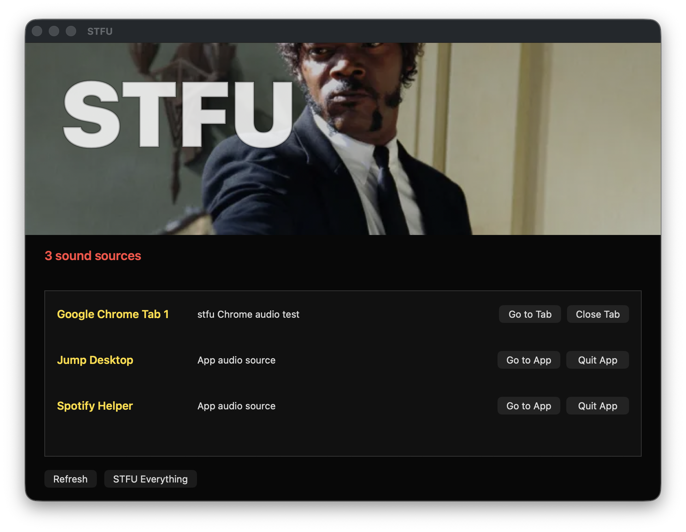

# STFU

Find the Mac app or browser tab making sound. Close that tab, quit that app, or silence everything.



For the stray video, song, or mystery tab you can hear but cannot find.

- Browser tab making noise: close only that tab.
- Mac app making noise: quit that app, with confirmation.
- Multiple sound sources: close them one at a time or use `STFU Everything`.

## Install

Requires macOS 14 or later.

Download the latest `STFU-*.dmg` from [GitHub Releases](https://github.com/hamelsmu/stfu/releases/latest), open it, and run `Install STFU.pkg`.

The installer adds:

- `/Applications/STFU.app`
- `/usr/local/bin/stfu`

Current release builds are unsigned unless the release notes say otherwise. If macOS blocks the installer, Control-click `Install STFU.pkg`, choose `Open`, and confirm you want to run it.

## Supported Sources

STFU closes individual noisy tabs for:

- Safari
- Google Chrome, Chrome Canary, Microsoft Edge, Brave, Chromium, and Arc

Other audio producers are shown as apps and can be quit from STFU.

## Permissions

Open `STFU.app`. If a browser row says it needs Accessibility, click `Open Settings`, then enable STFU in:

`System Settings > Privacy & Security > Accessibility`

macOS requires that permission so STFU can inspect browser tab strips and close only the noisy tab.

If STFU does not appear in the list, click `Open Settings` from the STFU row again. If STFU already appears enabled but Chrome still asks, toggle STFU off and on once. That can happen after replacing a local unsigned build.

macOS may also ask whether STFU can control Safari, Chrome, or another browser. Allow it; that Automation permission lets STFU identify Safari tabs while scanning and focus or close browser tabs. If you denied Automation, re-enable STFU in:

`System Settings > Privacy & Security > Automation`

Open STFU in that Automation list, enable the affected browser under it, then reopen STFU and click `Refresh`.

You can check the local setup from Terminal:

```sh
stfu --doctor
stfu --request-accessibility
```

## Use

In the app:

- `Go to Tab` / `Go to App`: jump to the noisy source.
- `Close Tab`: close only the noisy browser tab.
- `Quit App`: asks before quitting the noisy app. Unsaved work in that app could be lost.
- `STFU Everything`: asks before closing all noisy tabs and quitting noisy apps.
- `Open Settings`: open the relevant Accessibility or Automation permission page.
- `Refresh`: rescan current audio sources.

From Terminal:

```sh
stfu --list
stfu --dry-run
stfu
stfu --all
stfu --doctor
stfu --request-accessibility
```

## Build Locally

Requirements:

- macOS 14+
- Xcode command line tools
- Swift 6.0+
- `just` for the shortcut commands below

Common commands:

```sh
xcode-select --install
just build
just package
just verify
just install-local
```

The underlying scripts are plain shell, so this also works without `just`:

```sh
swift build -c release
scripts/package.sh
scripts/verify.sh
```

Set `VERSION` when you want a different artifact name:

```sh
VERSION=0.1.1 just package
```

Artifacts are written to:

- `dist/STFU-$VERSION.pkg`
- `dist/STFU-$VERSION.dmg`

Verify local artifacts:

```sh
VERSION=0.1.1
hdiutil verify "dist/STFU-$VERSION.dmg"
pkgutil --payload-files "dist/STFU-$VERSION.pkg"
```

## Publish a GitHub Release

The local release script is the authoritative path for publishing a GitHub Release. It builds, verifies, tags, pushes, and uploads the DMG/pkg with release notes:

```sh
VERSION=0.1.1 just release
```

Use a version that has not been published yet. If a tag already exists and you intentionally want to replace a draft/test release:

```sh
FORCE=1 VERSION=x.y.z just release
```

The GitHub Actions workflow also builds and verifies the package on macOS for pushed tags and manual runs. It uploads CI artifacts to the workflow run; it does not mutate the GitHub Release.

You need the GitHub CLI authenticated for the local release script:

```sh
gh auth login
```

For public distribution, sign and notarize the build:

```sh
APP_SIGN_IDENTITY="Developer ID Application: Your Name (TEAMID)" \
SIGN_IDENTITY="Developer ID Installer: Your Name (TEAMID)" \
DMG_SIGN_IDENTITY="Developer ID Application: Your Name (TEAMID)" \
NOTARY_PROFILE="notarytool-keychain-profile" \
scripts/package.sh
```

Developer ID app builds are signed with hardened runtime and the Apple Events entitlement STFU needs for browser control.
